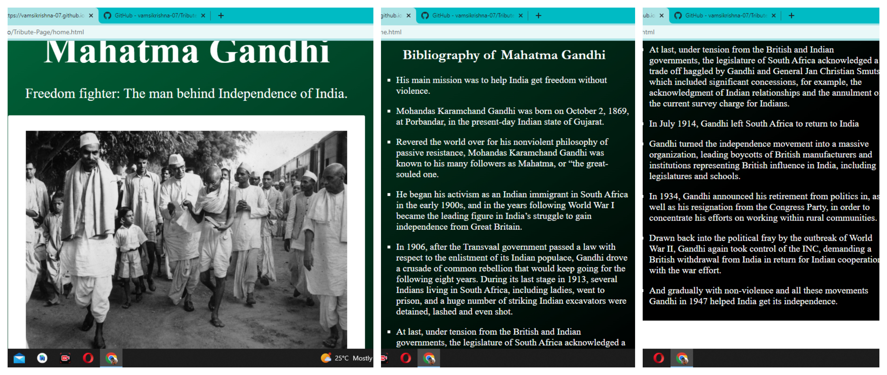
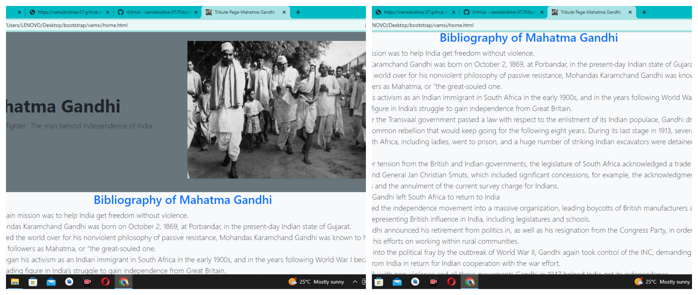

<h1 align="center">Hi 👋, I'm Vamsi Krishna</h1>
<h3 align="center">A passionate frontend developer from India</h3>
<h1>Assignment-1 HTML CSS</h1>

  

 
<h1>Assignment-2 Bootstrap</h1>

  

 

  

- 🔭 I’m currently working on [Html Css](https://vamsikrishna-07.github.io/Tribute-Page/home.html)

- 🌱 I’m currently learning **javascript , java**

- 📫 How to reach me **pvamsikrishna2004@gmail.com**

<h3 align="left">Connect with me:</h3>

<h3 align="left">Languages and Tools:</h3>

    

&nbsp;

